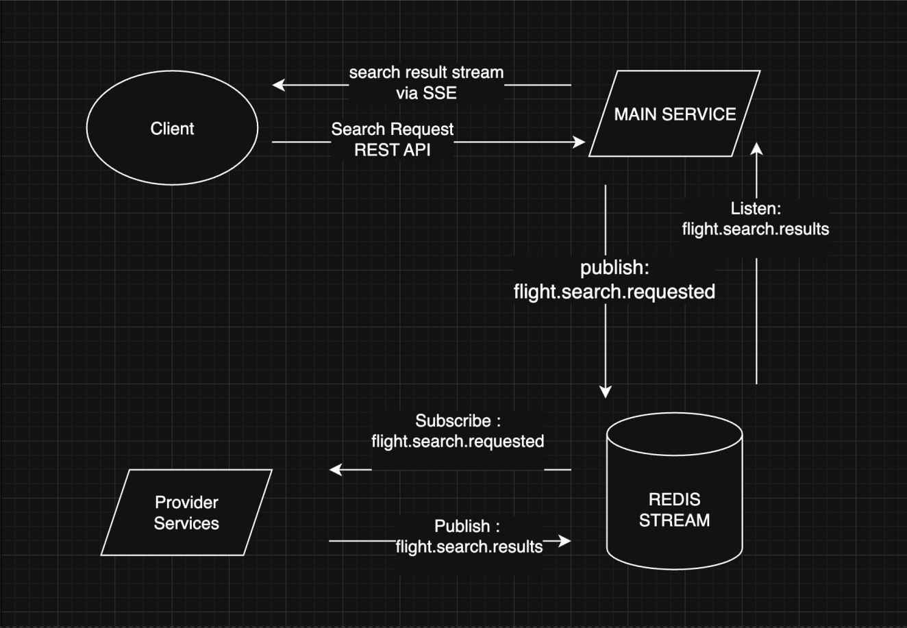

# ✈️ Flight Search System

Sistem ini merupakan implementasi microservice untuk pencarian penerbangan menggunakan pendekatan event-driven dengan **Redis Streams** sebagai media komunikasi antar layanan. Sistem terdiri dari beberapa komponen utama yang berinteraksi satu sama lain untuk menangani permintaan pencarian penerbangan dan mengirimkan hasilnya secara real-time ke client, serta dijalankan menggunakan Docker Compose.

---

## 🧭 Arsitektur Sistem


---

### Alur Kerja

1. **Client**
   - Mengirim permintaan pencarian penerbangan melalui endpoint **REST API** ke Main Service.
   - Menerima hasil pencarian secara real-time melalui **SSE (Server-Sent Events)**.

2. **Main Service**
   - Menerima request dari client.
   - Mempublikasikan event `flight.search.requested` ke **Redis Stream**.
   - Mendengarkan event `flight.search.results` dari Redis.
   - Mengirimkan hasil pencarian kembali ke client via SSE.

3. **Redis Stream**
   - Digunakan sebagai message broker antara Main Service dan Provider Services.
   - Stream yang digunakan:
     - `flight.search.requested`: menyimpan permintaan pencarian penerbangan.
     - `flight.search.results`: menyimpan hasil pencarian yang dikirim oleh provider.

4. **Provider Services**
   - Berlangganan (`subscribe`) ke stream `flight.search.requested`.
   - Menangani pencarian penerbangan, lalu mempublikasikan hasil ke stream `flight.search.results`.

---

## 🛠 Teknologi yang Digunakan

- Go (Golang)
- Redis (Redis Streams)
- Fiber (Web Framework)
- Server-Sent Events (SSE)

---

## 📦 Prasyarat

Pastikan sudah menginstal:

- [Docker](https://docs.docker.com/get-docker/)
- [Docker Compose](https://docs.docker.com/compose/install/) (untuk Docker versi lama, biasanya sudah termasuk di versi baru)

Cek versi:

```bash
docker -v
docker compose version
```
---

## 🚀 Cara Menjalankan (dengan Docker Compose)

### 1. Clone Repository

```bash
git clone https://github.com/yusufekoanggoro/flight-search-system
cd flight-search-system
```

### 2. Build dan Jalankan dengan Docker Compose

```bash
docker-compose up --build
```

Setelah proses selesai, main-service akan berjalan di:

```
http://localhost:3000
```

---